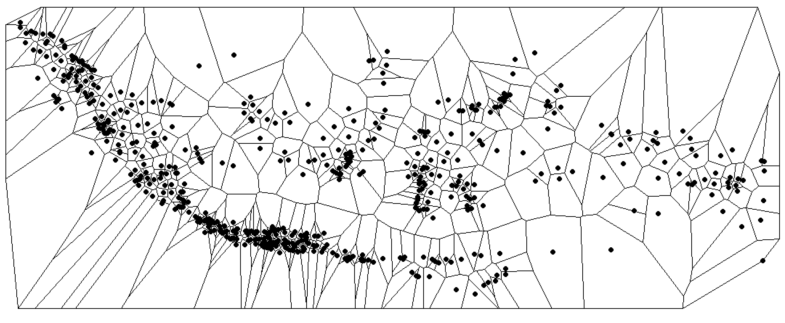
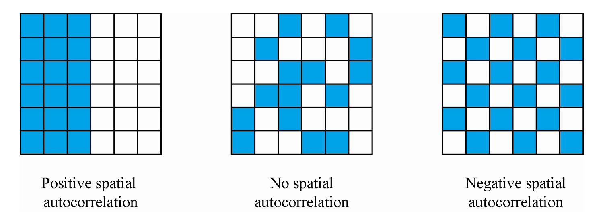
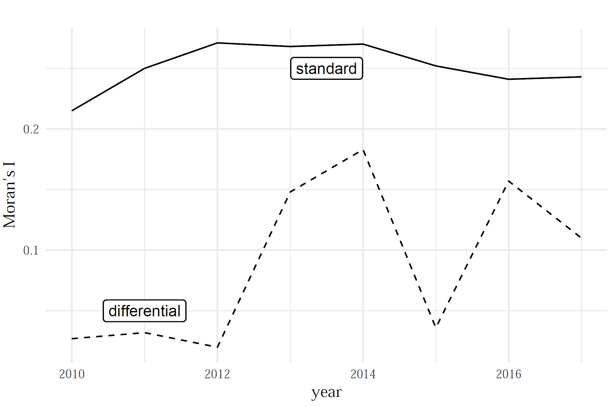
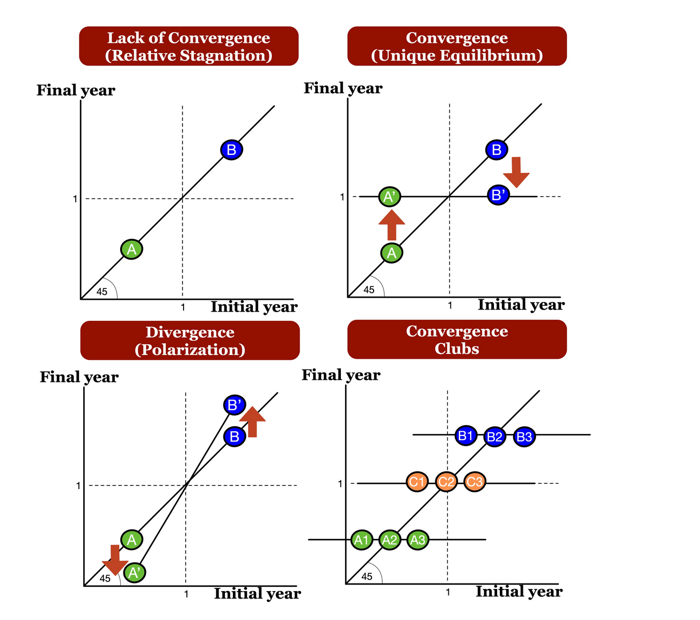
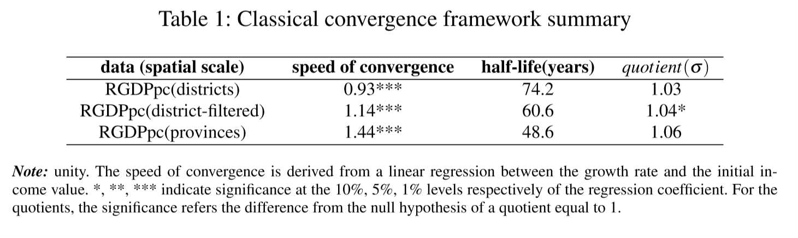

```{r setup, include=FALSE}
library(xaringan)
options(htmltools.dir.version = FALSE)
```


## Motivation:

- there is limited research about decentralization in Indonesia that has provided a conclusive answer on the regional income disparity dynamics
- Scarce academic literature on convergence at the distric  level. 
  
## Research Question:
  
- To what extent the role of space affects the convergence dynamics across Indonesian regions?

  
## Methods:

- Classical convergence framework (Barro and Sala-i-Martin 1992)
and  Distributional convergence framework (Quah 1996; Hyndman et. al 1996)

- Spatial autocorrelation (Moran's I and differential Moran's I)

- Getis Filter (Getis 1995)


---
# Main Results

1. **Significant Spatial Autocorrelation** at the district level. 

2. **Distributional Convergence** 

  - For provinces there are 4 convergence clubs
  - For districs high mobility in the upper tail of the distribution/
  
3. **Filtered data ** 

  - High mobility on the filtered distribution.
  - Faster convergence speed for fitlered data.
  
4. **Spatial effects**
  
  - Spatial effects are reducing the convergence of income at the distric level.

5. **Policy Implication**

  - Increasing the effectiveness of local government's policies and coordination among regions.
  
---
class: middle

# Outline of this presentation

1. **Introduction and Data**

  - Does decentralization promote regional development? 
  - A newly constructed dataset

2. **Spatial autocorrelation** 

  - Standard Moran's I
  - Differential Moran's I

3. **Spatial Filtering Perspectives** 

  - Distributional Dynamic Framework 
  - Getis Spatial Filter
    
4. **Income dynamic transition accross districts and provinces **

5. **The filtered data and spatial effects**
  
6. **Concluding Remarks**


---
class: middle

# (1) Data

**The centroid coordinates of the capital cities of the districts**



**A balanced dataset (districs interpolation). Income per capita for 34 provinces and 514 districts over the 2010-2017 period**


.pull-left[


]

.pull-right[


]


---

class: middle

# (1) Introduction: 
##Decentralization to promote regional growth

- After the implentation of decentralization in 2000,the number of provinces and districts (cities and regencies) increased significantly.

- Local governments are granted a greater political autonomy and substantial resposibilities for administration and public services provision.


---
class: middle

# (2) Spatial Autocorrelation : 

##Moran's I and Differential Moran's I

$$I = \frac{\sum_i\sum_j w_{ij} z_i.z_j}{\sum_i z_i^2} = \frac{\sum_i (z_i \times \sum_j w_{ij} z_j)}{\sum_i z_i^2}.$$

- To capture the magnitudes of linear relationship of a variable in one location with spatially weighted average of values at neighboring locations.

- The differential Moran's I is conducted to evaluate the robustness. 
 
 
---

class: middle

# Spatial Autocorrelation Moran's I 

##"Strong signs of spatial autocorrelation"



**Moran's I is significant at districts level (p-value<0.01) for all years from 2010-2017**

**The differential Moran's I is significant from 2013**

---

# (3) Spatial Filtering Persepective


 
**A spatial filtering of the data can help us to avoid misguided interpretation**

**Instead of using spatial regressions we can remove the spatial component of socio-economic variables**

---
class: middle, center
# (3) Distribution Dynamics Framework





---
# Income dynamics for districts

## Highmobility in the upper tail of the distribution

.pull-left[


]

.pull-right[


]

---
# (4) Income dynamics - provinces 

*Since Spatial autocorrelation is not significant for provinces just dutributional and classical convergence analysis are reported.*

.pull-left[


]

.pull-right[

**There are at least 2 convergence clubs, 
two in the upper tail and 2 in the middle of the distribution**  


]


---
# (5) Filtered income dynamics 

## Distributional convergence and clusters for the **filterd income variable**


.pull-left[


]

.pull-right[


]


---

# (5) Classical convergence results 


.pull-left[


]

.pull-right[


]




---
# (6) Concluding Remarks

## Inequality still matters  :

- Low mobility for the poorest districts and provinces
- The convergence speed is below the standard in the regional literature
- Spatial effects are reducing the pace of convergence 

## Implications 

- The spatially filtered regional income is important in order to avoid misleading interpretations.
- Call for better coordination of regional policies at the cluster level.
- Enhance interregional connectivity and cooperation.


---
class: center
# Thanks!

** Thank you very much for your attention**

QuaRCS lab website 
https://quarcs-lab.rbind.io/

 

**Quantitative Regional and Computational Science Lab**


